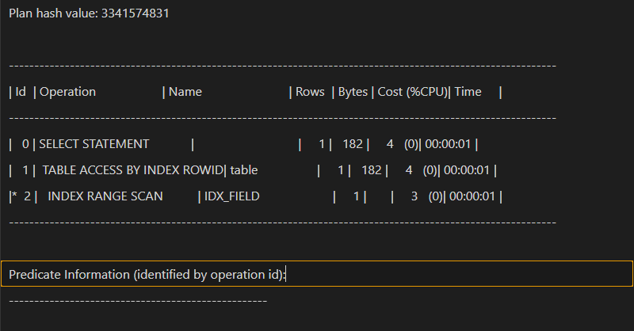

# Oracle查看执行计划

## 背景

- 一直测试环境数据用的都是Mysql，执行计划就Plan一下就完事
- 但有天群里老哥发了一条Oracle的慢SQL，忽然一下还不会查执行计划
- 发现Oracle看执行计划还有点绕绕，就记录一下

## 具体操作

- Oracle是需要先把执行计划塞到`plan_table`中
  - `EXPLAIN PLAN SET STATEMENT_ID = 'my_query' INTO plan_table FOR `后面跟要查询的语句
  - 假如我要查`select * from table where field1 = '123' and field2 = '123' and field3 = '123';`
  - 就直接执行`EXPLAIN PLAN SET STATEMENT_ID = 'my_query' INTO plan_table FOR select * from table where field1 = '123' and field2 = '123' and field3 = '123';`
  - 里面的`STATEMENT_ID`字段是用来标识你刚塞入的这条执行计划的
  - 可以随意命名
- 然后再去把这个执行计划查出来
  - `SELECT * FROM table(DBMS_XPLAN.DISPLAY('plan_table', 'my_query', NULL, NULL));`
  - 
  - 完事
- 关于怎么看执行计划的。。再说吧