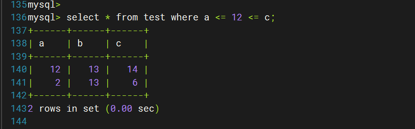
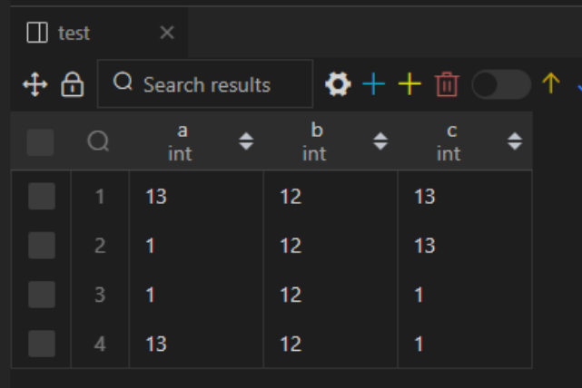
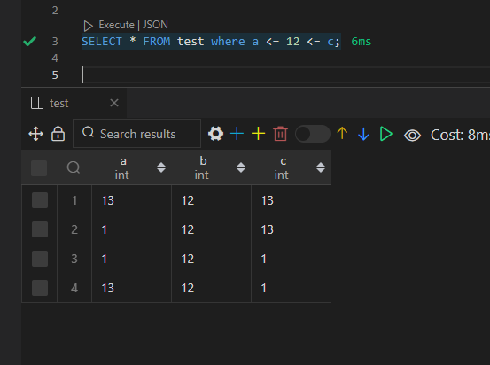

# SQL-MySQL中连等或其他连续比较运算符逻辑

## 问题背景

- 今天群里朋友忽然发了这么一条问题，问：“有见过mysql中的这种写法嘛，这是等价于and还是or”

- 然后群里几个小伙伴先是狂喷了一波是怎么写出这种狗屎SQL的。。随后探讨了一波这个问题

## 问题分析

- 看到这张图的第一想法。。是根据结果去反推。
- 反推的结果显然是or
- 但想来想去。这样一个连续的比较运算符。凭什么就看作是or呢？？？
- 越想越难受。去验证一波吧。。。

### 一次实验

- 第一次准备了这些数据，想验证它到底是and还是or
- 
- 使用这几条sql去验证
```sql
-- or的情况
SELECT * FROM test where a <= 12 or 12 <= c;
-- and的情况
SELECT * FROM test where a <= 12 and 12 <= c;
-- 待验证的逻辑
SELECT * FROM test where a <= 12 <= c;
```
- 惊了！！待验证的返回的竟然是全部的数据集。。既不是and也不是or
- 

#### 实验想法

- 于是我回复他。可能是这个写法根本不合理，所以就相当于没有where条件吧
- 但是回复了之后再转回头一想。sql里where子句是否命中走的不是**三值逻辑**么？？
- 不合理的话。要不然是**语法报错**要不然是`unknown`呀？
- `unknown`的数据是不会被命中返回的。被返回的只可能是计算为`true`的数据呀
- 继续排查一波

### 二次实验


### 三次实验


## 问题解决


## 延伸


