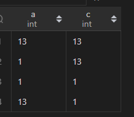

# SQL-MySQL中连等或其他连续比较运算符逻辑

## 问题背景

- 今天群里朋友忽然发了这么一条问题，问：“有见过mysql中的这种写法嘛，这是等价于and还是or”

- 然后群里几个小伙伴先是狂喷了一波是怎么写出这种狗屎SQL的。。随后探讨了一波这个问题

## 问题分析

- 看到这张图的第一想法。。是根据结果去反推。
- 反推的结果显然是or
- 但想来想去。这样一个连续的比较运算符。凭什么就看作是or呢？？？
- 越想越难受。去验证一波吧。。。

### 一次实验

- 第一次准备了这些数据，想验证它到底是and还是or
- 
- 使用这几条sql去验证
```sql
-- or的情况
SELECT * FROM test where a <= 12 or 12 <= c;
-- and的情况
SELECT * FROM test where a <= 12 and 12 <= c;
-- 待验证的逻辑
SELECT * FROM test where a <= 12 <= c;
```
- 惊了！！待验证的返回的竟然是全部的数据集。。既不是and也不是or
- 

#### 实验想法

- 于是我回复他。可能是这个写法根本不合理，所以就相当于没有where条件吧
- 但是回复了之后再转回头一想。sql里where子句是否命中走的不是[三值逻辑(SQL-where子句谓词函数&三值逻辑)](..\SQL-where子句谓词函数&三值逻辑.md)么？？
- 不合理的话。要不然是**语法报错**要不然是`unknown`呀？
- `unknown`的数据是不会被命中返回的。被返回的只可能是计算为`true`的数据呀
- 继续排查一波
- 排查思路是，直接把它们select出来看看

### 二次实验

- 执行`SELECT a <= 12 <= c FROM test;`
- 发现执行的结果都是`1`！
- 
- 数据类型的bigint忽然点醒！表达式的的true和false是表现在一个int值上的
- 那么在这个数据集中
    - 会不会是最左匹配先计算a <= 12，用得到的值和c进行匹配了(a <= 12) <= c？
    - 如果是这个情况的话就说得通了，(a <= 12)不管是true还是false，都表示为0或者1，在这个数据集中，C的值我都设置的是大于这个的
- 先继续用这个数据集验证，重新展示数据集（发现B并没有什么用。把B这个字段移除了）
- 
- 把这个表达式中的`<=`变成`<`试一下
- 如果刚刚的猜想没错，返回的结果集应该是
    1. (a < 12)为false，0 < 13 结果为true，命中
    2. (a < 12)为true，1 < 13 结果为true，命中
    3. (a < 12)为true，1 < 1 结果为false，不命中
    4. (a < 12)为false，0 < 1 结果为true，命中
- `SELECT * FROM test where a < 12 < c;`
- 
- 结果不出所料
- 但还需要一个小实验证明一下

### 三次实验

- 准备数据集
- 
- 分别查询sql:
  - `SELECT * FROM test where a < 12 < c;`
  - `SELECT * FROM test where a <= 12 <= c;`
- 结果分别为：
  - 
  - 
- 再配合一条:`SELECT a < 12, c, a < 12 < c FROM test;`
- 
- 结果很显然，只有在`a < 12`这一列的值与`c`的比较运算符的结果决定了`a < 12 < c`与`a <= 12 <= c`的结果，这些结果也与where子句命中的情况相符

## 问题解决

- SQL中的连续比较运算符，是有最左优先计算的原则的
- 哪怕是四个、五个连续的比较，也是同样的逻辑，例如：
    - `a <= 12 <= c > c = 0`
    - 只需要按`(((a <= 12) <= c) > c) = 0`来看
    - 如果a、c分别为13、1，就可以转化为`13 <= 12 = false(0) --> 0 <= 1 = true(1) --> 1 > 1 = false(0) --> 0 = 0 --> true(1)`
    - 来看出这行13、1的数据会被命中
- 结论：**MySQL中连续的比较运算符，按结合律的方式，把boolean值转换为int值，再进行后续的运算**
