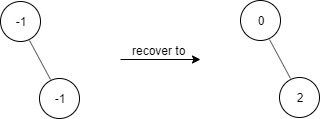
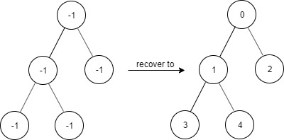
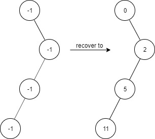
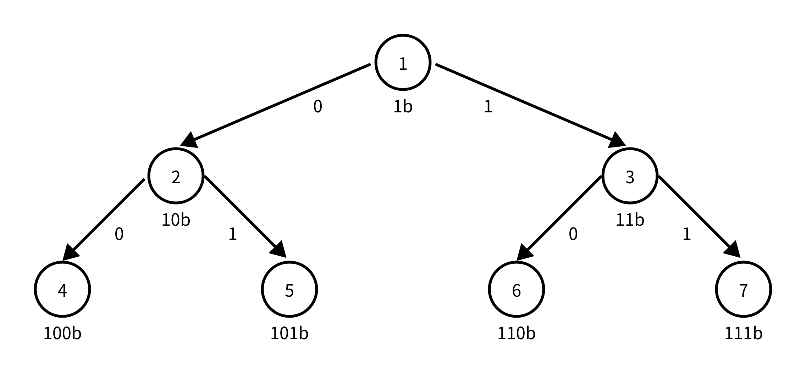

# [1261. 在受污染的二叉树中查找元素](https://leetcode.cn/problems/find-elements-in-a-contaminated-binary-tree/description/)

## 说明

```
给出一个满足下述规则的二叉树：
1. root.val == 0
2. 如果 treeNode.val == x 且 treeNode.left != null，那么 treeNode.left.val == 2 * x + 1
3. 如果 treeNode.val == x 且 treeNode.right != null，那么 treeNode.right.val == 2 * x + 2

现在这个二叉树受到「污染」，所有的 treeNode.val 都变成了 -1。

请你先还原二叉树，然后实现 FindElements 类：

 - FindElements(TreeNode* root) 用受污染的二叉树初始化对象，你需要先把它还原。
 - bool find(int target) 判断目标值 target 是否存在于还原后的二叉树中并返回结果。
```

示例 1：

```
输入：
["FindElements","find","find"]
[[[-1,null,-1]],[1],[2]]
输出：
[null,false,true]
解释：
FindElements findElements = new FindElements([-1,null,-1]); 
findElements.find(1); // return False 
findElements.find(2); // return True 
```

示例 2：

```
输入：
["FindElements","find","find","find"]
[[[-1,-1,-1,-1,-1]],[1],[3],[5]]
输出：
[null,true,true,false]
解释：
FindElements findElements = new FindElements([-1,-1,-1,-1,-1]);
findElements.find(1); // return True
findElements.find(3); // return True
findElements.find(5); // return False
```
示例 3：

```
输入：
["FindElements","find","find","find","find"]
[[[-1,null,-1,-1,null,-1]],[2],[3],[4],[5]]
输出：
[null,true,false,false,true]
解释：
FindElements findElements = new FindElements([-1,null,-1,-1,null,-1]);
findElements.find(2); // return True
findElements.find(3); // return False
findElements.find(4); // return False
findElements.find(5); // return True
```
```
提示：
TreeNode.val == -1
二叉树的高度不超过 20
节点的总数在 [1, 10^4] 之间
调用 find() 的总次数在 [1, 10^4] 之间
0 <= target <= 10^6
```
## 题解思路

### DFS + HashSet搜索

- 初始化树实际上就是一个赋值的操作
- 递归遍历树，将每个节点赋值，并将其加入到HashSet中
- 在find的时候直接判断target是否在HashSet中即可
- 时间复杂度：O(n)
- 空间复杂度：O(n)  主要是存放值的HashSet

### DFS + 二进制位数判断

- 在看题目的时候就觉得，这个树的每个节点的值实际上是已经确认的
- 所以可以使用二进制位数判断来判断一个数是否在树中
- 一开始没啥想法，看了官方题解的那个图之后豁然开朗（但感觉官方题解那个方法好难懂。按我理解的实现了一套。感觉应该好懂点）
- 
- 逻辑上把树的所有节点+1（因为这样，树的每一层才是按二进制位数排列的）
- 这个情况可以直接把target+1，和target不+1，树的每个节点+1逻辑上是等价的，写的逻辑更清晰
- 然后把这个target转成二进制字符数组，从根节点之后开始遍历
- 这个时候，这个二进制数组的每一位，其实都标明着这个target在左节点还是右节点
  - 为0，表示在左节点，为1，表示在右节点
- 然后就这样遍历下去，如果遇到为空的节点了，就证明这个数不存在，遍历完成了，证明这个数存在

## Code

### DFS + HashSet搜索

```java
class FindElements {

    private TreeNode root = null;

    private Set<Integer> set = new HashSet<>();

    public FindElements(TreeNode root) {
        root.val = 0;
        set.add(root.val);
        init(root);
        this.root = root;
    }

    private void init(TreeNode node) {
        if (node.left != null){
            node.left.val = node.val * 2 + 1;
            set.add(node.left.val);
            init(node.left);
        }
        if (node.right != null){
            node.right.val = node.val * 2 + 2;
            set.add(node.right.val);
            init(node.right);
        }
    }
    
    public boolean find(int target) {
        return this.set.contains(target);
    }
}
```

### DFS + 二进制位数判断

```java
class FindElements {

    private TreeNode root = null;

    public FindElements(TreeNode root) {
        root.val = 0;
        init(root);
        this.root = root;
    }

    private void init(TreeNode node) {
        if (node.left != null){
            node.left.val = node.val * 2 + 1;
            init(node.left);
        }
        if (node.right != null){
            node.right.val = node.val * 2 + 2;
            init(node.right);
        }
    }
    
    public boolean find(int target) {
        // 如果是0的话，直接返回，因为对根节点来说没有判断的路子
        if (target == 0) return true;
        // 这里+1的目的是，为了让树中的每一层都符合二进制的位数，看上面的图瞅瞅
        target++;
        // 这里转成二进制字符数组，下面直接按位判断就完事了
        char[] binaryCharArr = Integer.toBinaryString(target).toCharArray();
        TreeNode node = root;
        for(int i = 1; i < binaryCharArr.length; i++){
            // 如果当前位数为0，则证明这个数字应该在左节点那边，如果为1，说明应该在you节点那边
            if (binaryCharArr[i] == '0'){
                if (node.left == null) return false;
                node = node.left;
            } else {
                // 如果节点为空，说明值为target的数不存在，直接返回
                if (node.right == null) return false;
                // 如果存在，调整一下节点指针，继续向下判断
                node = node.right;
            }
        }
        // 判断完了这个数的每一位，没有为空返回，则证明存在
        return true;
    }
}
```
