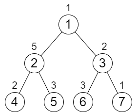

## 2673. 使二叉树所有路径值相等的最小代价

### 说明

```
给你一个整数 n 表示一棵 满二叉树 里面节点的数目，节点编号从 1 到 n 。根节点编号为 1 ，树中每个非叶子节点 i 都有两个孩子，分别是左孩子 2 * i 和右孩子 2 * i + 1 。

树中每个节点都有一个值，用下标从 0 开始、长度为 n 的整数数组 cost 表示，其中 cost[i] 是第 i + 1 个节点的值。每次操作，你可以将树中 任意 节点的值 增加 1 。你可以执行操作 任意 次。

你的目标是让根到每一个 叶子结点 的路径值相等。请你返回 最少 需要执行增加操作多少次。

注意：

- 满二叉树 指的是一棵树，它满足树中除了叶子节点外每个节点都恰好有 2 个子节点，且所有叶子节点距离根节点距离相同。
- 路径值 指的是路径上所有节点的值之和。
```

- 示例 1：

```
输入：n = 7, cost = [1,5,2,2,3,3,1]
输出：6
解释：我们执行以下的增加操作：
- 将节点 4 的值增加一次。
- 将节点 3 的值增加三次。
- 将节点 7 的值增加两次。
从根到叶子的每一条路径值都为 9 。
总共增加次数为 1 + 3 + 2 = 6 。
这是最小的答案。
```

- 示例 2：

```
输入：n = 3, cost = [5,3,3]
输出：0
解释：两条路径已经有相等的路径值，所以不需要执行任何增加操作。
```

### 题解思路

- 将数组逻辑上解析为树
  - 若当前节点为x
  - 则其左子节点为2x，右子节点为2x+1，其父节点为x/2向下取整

#### 自顶向下

- 用DFS的方式自顶向下遍历树，计算每个节点的路径和
- 比较兄弟节点的大小，取较大值+子节点较大值作为当前节点的路径和
- 兄弟节点间作差，差值即为需要操作的次数，累加

#### 自底向上

- 每个节点向下的最大路径和可以算作：本节点值 + 叶子节点最大值(一定相同，因为自底向上做的操作)
- 那么每次只需要拉齐的时候，将当前节点的值向上影响即可

### 代码

#### 自顶向下

```Java
class Solution {
    private int num;
    private int[] tree;
    private int res;
    public int minIncrements(int n, int[] cost) {
        this.num = n;
        this.tree = cost;
        dfs(0);
        return res;
    }

    // node为当前节点的下标
    private int dfs(int node) {
        // 如果判断当前节点为叶子节点，返回节点值
        if (node * 2 + 1 >= num) {
            return tree[node];
        }
        // 取左子节点路径和
        int left = dfs(node * 2 + 1);
        // 取右子节点路径和
        int right = dfs(node * 2 + 2);
        // 计算子节点需要的操作数，累加到res中
        res += Math.abs(left - right);
        // 返回该节点以下的路径和数值
        return Math.max(left, right) + tree[node];
    }
}
```

#### 方法二

```Java
class Solution {
    public int minIncrements(int n, int[] cost) {
        int res = 0;
        for (int i = n - 1; i > 0; i -= 2){
            // 本节点值
            int cur = cost[i];
            // 兄弟节点值
            int brother = cost[i - 1];
            // 拉齐本节点和兄弟节点，累加操作数
            res += Math.abs(cur - brother);
            // 递归向上更新，父节点向下取整
            cost[(i - 1) / 2] += Math.max(cur, brother);
        }
        return res;
    }
}
```

